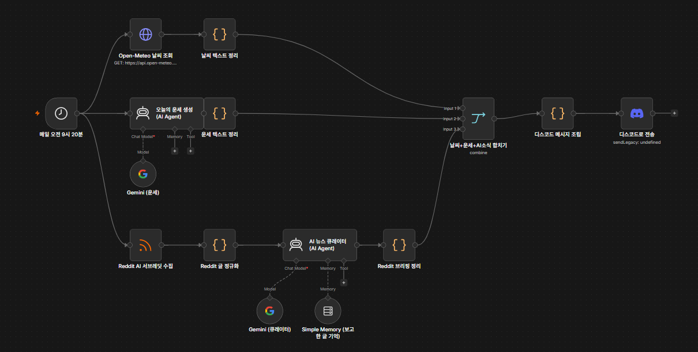
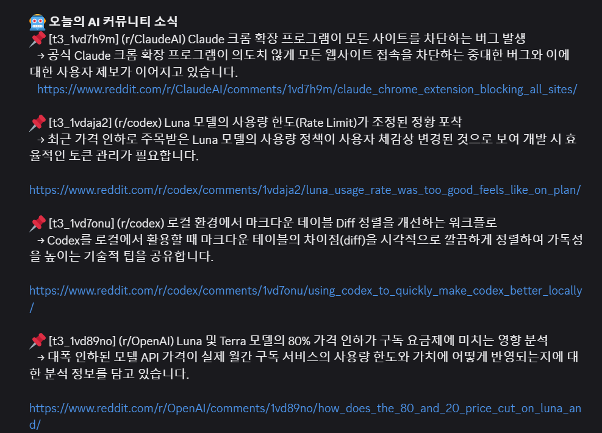

# 2026-07-30 — n8n 날씨·운세 자동화 봇

## 오늘 한 일
- n8n으로 "매일 아침 지정 시각에 오늘의 날씨 + 오늘의 운세를 디스코드로 보내주는" 워크플로우 제작
- Schedule Trigger(매일 09:20) → Open-Meteo 날씨 조회와 AI Agent(Gemini) 운세 생성을 병렬로 실행 → Merge → 메시지 조립 → Discord Webhook 전송까지 전체 파이프라인 구성

## 배운 점
- 워크플로우를 "내용은 매번 달라지지만 형식은 항상 동일하게" 설계하려면, AI가 채우는 부분(운세 문장)과 코드로 고정하는 부분(제목·이모지·항목 순서)을 명확히 분리해야 한다는 것
- 서로 의존관계가 없는 두 작업(날씨 조회, 운세 생성)은 트리거에서 병렬 브랜치로 나눠 실행하고, `Merge` 노드로 다시 합칠 수 있다는 것
- **Merge 노드 트러블슈팅**: `Combine` 모드에서 기본값인 `Matching Fields`를 쓰면 "Fields to Match를 정의하라"는 에러가 남 — 두 브랜치의 필드명이 겹치지 않고 단순 병렬 결과만 합치면 되는 경우 `Combine By: Position`으로 바꿔야 한다는 것
- **민감정보 관리**: Gemini API 키와 Discord Webhook URL을 노드 파라미터에 직접 입력하면 워크플로우를 export할 때 평문으로 노출된다는 것 — n8n의 Credential 시스템(Header Auth / Discord Webhook 타입)으로 옮겨 암호화 저장해야 워크플로우 JSON 자체에는 키가 남지 않는다는 것

## 주말 보충 — AI STUDIO 과제 제출용으로 확장(08-02)

이날 만든 "날씨+운세" 워크플로를 주말에 과제 제출용으로 한 단계 더 확장했다. Reddit에서 AI 관련 서브레딧 글을 수집해 AI Agent(큐레이터)가 브리핑으로 정리하는 세 번째 브랜치를 추가하고, 날씨·운세·AI 소식 세 갈래를 하나로 합쳐 디스코드로 보내는 구조로 발전시켰다.

- Reddit 큐레이터 AI Agent에 `Simple Memory`를 붙여, 같은 글을 반복 보고하지 않도록 이전에 소개한 글을 기억하게 만들었다는 것
- 세 브랜치(날씨/운세/AI 뉴스)를 합칠 때도 이전에 배운 `Merge` 노드를 그대로 재사용했다는 것 — 입력 개수만 3개로 늘었을 뿐 구조는 동일하다

