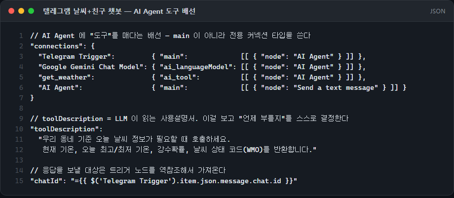
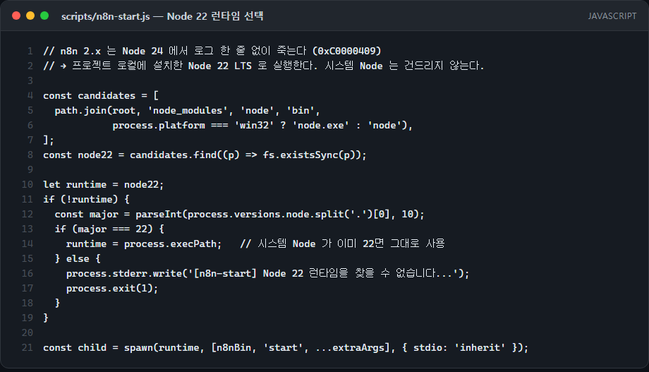
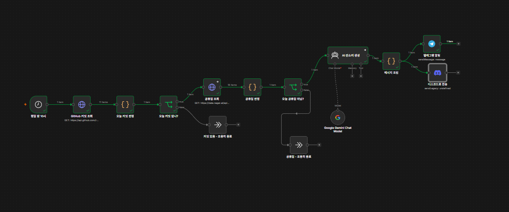
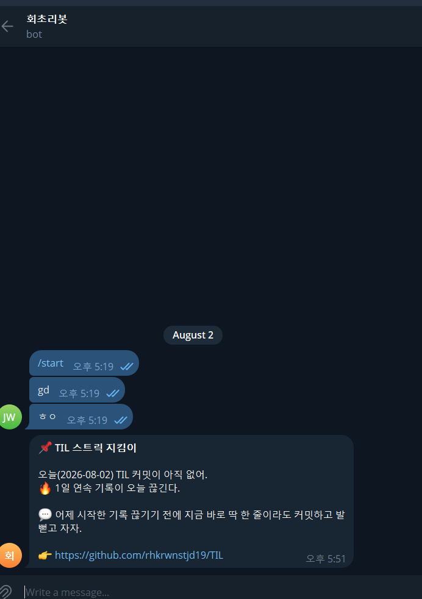
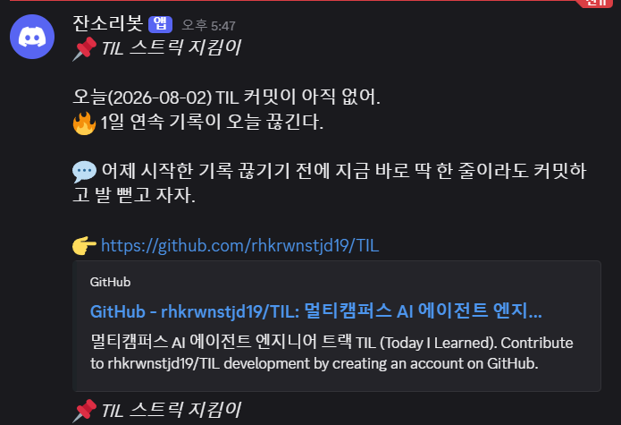

# 2026-07-31 — n8n AI Agent 텔레그램 챗봇 (도구 호출)

## 오늘 한 일
- n8n으로 "텔레그램에서 말을 걸면 친구처럼 답하되, 날씨를 물으면 실제 날씨 데이터를 근거로 답하는" 챗봇 제작
- Telegram Trigger(message 수신) → AI Agent(Gemini 2.5 Flash) → Send a text message 로 이어지는 대화 파이프라인 구성
- AI Agent에 Open-Meteo(집 근처 좌표)를 호출하는 HTTP Request Tool을 `get_weather` 라는 이름의 **도구**로 매달아, 날씨 질문일 때만 스스로 호출하게 함

## 배운 점
- 어제(7/30)까지는 **내가 코드로 분기**를 짰다면(병렬 브랜치 → Merge), AI Agent는 **판단 자체를 LLM에게 위임**하는 구조라는 것 — 언제 도구를 부를지를 워크플로가 아니라 모델이 정한다
- n8n에서 AI Agent에 모델과 도구를 연결할 때는 일반 `main` 커넥션이 아니라 **`ai_languageModel` / `ai_tool` 전용 커넥션 타입**으로 매달아야 한다는 것 — 캔버스에서 노드 아래쪽 점에 붙는 연결이 이것이다
- **`toolDescription`이 곧 LLM이 읽는 사용설명서**라는 것 — 여기에 "무엇을 반환하는지"와 "언제 호출해야 하는지"를 적어야 모델이 제때 도구를 부른다. 도구를 붙여놔도 설명이 부실하면 그냥 지어내서 답한다
- 도구 호출을 강제하려면 systemMessage에 **규칙으로 못박아야** 한다는 것 — "날씨 관련 질문이면 반드시 `get_weather`를 호출해서 받아온 실제 데이터를 근거로 답하라"처럼 조건과 도구 이름을 같이 써야 안정적이다
- 응답을 **누구에게** 보낼지는 트리거 노드를 역참조해서 가져온다는 것 — `{{ $('Telegram Trigger').item.json.message.chat.id }}`. AI Agent를 거치면 `$json`은 모델 출력(`output`)으로 바뀌어 있어서 원본 메시지 정보가 사라진다
- 워크플로 JSON을 export하면 credential이 id 참조로만 남는다는 것 — 다른 PC에서 import하면 `REPLACE_AFTER_IMPORT` 상태라 자격증명을 다시 연결해줘야 동작한다

## 주말 보충 — n8n 로컬 실행 환경 & Claude Code MCP 연동

수업에서 만든 워크플로를 내 PC에서 직접 굴리려고 로컬 n8n 환경을 세팅했다.

- **n8n이 로그 없이 죽는 문제**: 시스템 Node가 v24인데 n8n 2.x는 Node 24에서 **아무 로그도 없이** 즉시 종료된다(Windows 종료코드 `0xC0000409` = `STATUS_STACK_BUFFER_OVERRUN`, 네이티브 크래시). `package.json`의 `engines: >=22.22`는 통과하는데 실제로는 죽어서 원인 찾기가 오래 걸렸다 → **프로젝트 로컬에 Node 22 LTS를 devDependency로 설치**하고 런처 스크립트가 그 런타임으로 n8n을 띄우게 해서 해결. 시스템 Node는 건드리지 않았다
- **에러 메시지가 없는 것 자체가 단서**라는 것 — 스택트레이스 없이 종료되면 애플리케이션 예외가 아니라 런타임/ABI 레벨 문제를 의심해야 한다
- **`.mcp.json`은 `.env`를 읽지 않는다는 것** — `${VAR}` 치환은 프로세스 환경변수에서만 일어난다. API Key를 커밋 대상 파일에 직접 쓰지 않으려면 런처 스크립트가 `.env`를 읽어 주입해야 한다
- **stdio 기반 MCP 서버는 stdout이 곧 통신 채널**이라는 것 — n8n-mcp가 최초 실행 시 텔레메트리 안내 배너를 stdout으로 출력해 JSON-RPC 스트림을 오염시킨다. `N8N_MCP_TELEMETRY_DISABLED=true`로 꺼야 정상 통신한다. MCP 서버에서 `console.log` 한 줄이 프로토콜을 깨뜨릴 수 있다
- n8n MCP 툴은 **API Key 유무로 노출 범위가 갈린다는 것** — 키 없이는 문서 조회·검증 7개, 키를 넣으면 인스턴스 관리까지 24개
- **로컬 n8n으로는 텔레그램 웹훅을 받을 수 없다는 것** — `localhost`는 외부에서 호출 불가라 트리거가 안 걸린다. `--tunnel` 모드로 띄워야 외부 웹훅이 도달한다

## 주말 보충 — AI STUDIO 과제 제출용으로 확장(08-02)

이날 만든 텔레그램 AI Agent를 과제 제출용으로 확장했다. 도구를 `get_weather` 하나에서 `get_crypto_price`(업비트 시세)·`get_pokemon`까지 3개로 늘리고, 텔레그램 답장과 동시에 같은 내용을 디스코드 채널에도 전송하도록 출력 채널을 하나 더 붙였다.

- 도구가 늘어나도 구조는 그대로라는 것 — `get_weather` 를 매달았던 것과 똑같은 방식(`ai_tool` 커넥션)으로 HTTP Request Tool을 병렬로 더 붙이기만 하면 된다
- 한 응답을 두 채널(텔레그램·디스코드)에 동시에 보내려면, 응답을 만든 뒤 전송 노드를 두 개로 병렬 분기하면 된다는 것 — 조립 로직을 채널마다 중복할 필요가 없다

