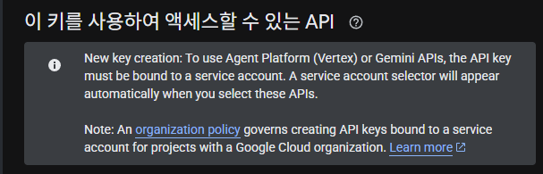

# 2026-08-11 — Gemini API 403 트러블슈팅 & 파이썬 조건문

## 오늘 한 일
- 미니프로젝트(나라장터 공고 매칭 서비스) 이어서 개발: 오전엔 프로필 선택·매칭 축·업종 라벨 작업, 오후엔 구글 로그인(Auth) 기능 추가
- Gemini API 호출이 막히는 문제를 진단하고, 백엔드(AI Studio/Vertex)를 환경변수로 분리하는 방식으로 해결
- 공고 상세 조회에 첨부문서 목록·평가배점·자격등록마감 값을 추가하고, RFP 첨부문서 요약 기능의 설계 문서·실측 조사를 작성(구현은 다음 단계)
- 별도로 파이썬 기초 문제풀이 레포에서 변수·조건문 문제(총 13문항)를 전부 풀고, 조건문 이론(`if`/`elif`/`else`, 중첩 조건문)을 학습

## 배운 점
- **API 키의 "제한 대상"과 호출 엔드포인트가 어긋나면 403이 난다는 것** — 구글 클라우드 콘솔에서 API 키를 만들 때 고르는 제한 대상(`Gemini API` vs `Agent Platform API`)이 실제 코드가 부르는 엔드포인트(AI Studio `generativelanguage.googleapis.com` vs Vertex `aiplatform.googleapis.com`)와 어긋나면 `403 API_KEY_SERVICE_BLOCKED`가 발생한다는 것

- **환경변수로 백엔드를 분기해두면 키 발급 방식이 바뀌어도 코드를 안 고쳐도 된다는 것** — `GENAI_BACKEND` 값 하나로 AI Studio/Vertex 두 경로를 순수 함수로 나눠, 어느 쪽으로 키를 발급받든 설정만 바꾸면 되게 만들었다는 것
- **이미 호출하는 API 응답에 들어있는 값은 색인에 없어도 화면에 쓸 수 있다는 것** — 공고 상세 API 응답에 이미 포함된 평가배점·자격등록마감 값을 별도 호출 없이 그대로 뽑아 쓰기로 했다는 것
- **LLM 요약 기능에서 "인용"과 "서술"을 분리해야 과잉 차단을 피할 수 있다는 것** — 문서 원문을 그대로 옮긴 인용에는 금지어 필터를 적용하지 않고, 모델이 지어낸 서술(요약문)에만 적용해야 한다는 것(원문의 "안전관리" 같은 단어가 판정 표현으로 오인돼 걸러진 사례에서 확인)
- **파이썬 `elif`는 중첩된 `if`/`else`를 대체해 들여쓰기를 줄여준다는 것**
- **파이썬은 들여쓰기로 코드 블록을 구분하며, 들여쓰기하지 않은 코드는 조건과 무관하게 항상 실행된다는 것**

## 막혔던 점
- **Gemini API 403 트러블슈팅**: 발급받은 API 키가 `Agent Platform API`(Vertex)로 제한돼 있는데 코드는 AI Studio 엔드포인트를 호출해 `API_KEY_SERVICE_BLOCKED` 에러가 발생함 → 백엔드 선택 로직을 환경변수(`GENAI_BACKEND`)로 분리해, 어느 쪽으로 키를 발급받든 설정값만 바꾸면 맞출 수 있도록 구조를 고쳐서 해결

## 다음에 볼 것
- RFP 첨부문서 요약 기능 실제 구현(1단계: 첨부 목록 표시부터 — 오늘은 설계·조사까지만 진행)
- 파이썬 기초: 리스트(`python_06`)·반복문(`python_07`) 및 관련 문제(`problem03~05`)
